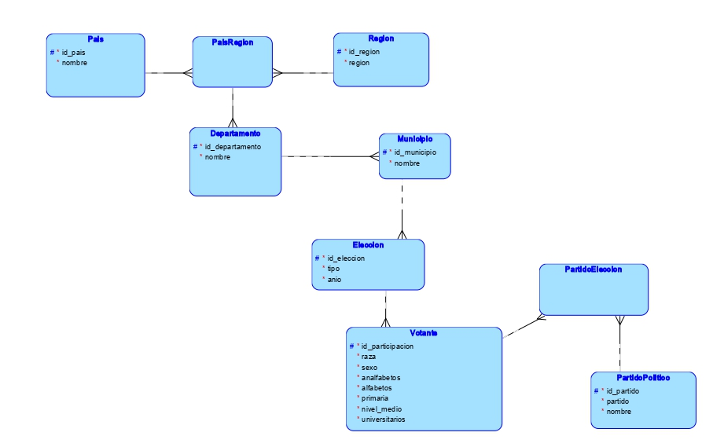

UNIVERSIDAD DE SAN CARLOS DE GUATEMALA  
FACULTAD DE INGENIERÍA  
ESCUELA DE CIENCIAS Y SISTEMAS    
SEMINARIO DE SISTEMAS 1

Primer Semestre 2024

**Autores:**

**Hugo Sebastian Martínez Hernández       &nbsp;&nbsp;&nbsp; &nbsp;&nbsp;&nbsp;&nbsp;&nbsp;&nbsp;        Carné: 202002793**
**Katheryn Darleny Yuman Oscal          &nbsp;&nbsp;&nbsp; &nbsp;&nbsp;&nbsp;&nbsp;&nbsp;&nbsp;        Carné: 201902209**
**Isai Figuer Figueroa Farfan          &nbsp;&nbsp;&nbsp; &nbsp;&nbsp;&nbsp;&nbsp;&nbsp;&nbsp;        Carné: 201904013**

## Descripción de las Tablas

### Tabla `Pais`
- **Descripción**: Almacena información sobre los países.
- **Columnas**:
  - `id_pais`: Identificador único del país (clave primaria).
  - `nombre`: Nombre del país.

### Tabla `Region`
- **Descripción**: Guarda información sobre las regiones.
- **Columnas**:
  - `id_region`: Identificador único de la región (clave primaria).
  - `region`: Nombre de la región.

### Tabla `PaisRegion`
- **Descripción**: Establece la relación entre países y regiones.
- **Columnas**:
  - `pais_id_pais`: Referencia al ID del país.
  - `region_id_region`: Referencia al ID de la región.

### Tabla `Departamento`
- **Descripción**: Contiene información sobre los departamentos.
- **Columnas**:
  - `id_departamento`: Identificador único del departamento (clave primaria).
  - `nombre`: Nombre del departamento.
  - `paisregion_pais_id_pais`: Referencia al ID del país en la tabla `PaisRegion`.
  - `paisregion_region_id_region`: Referencia al ID de la región en la tabla `PaisRegion`.

### Tabla `Municipio`
- **Descripción**: Almacena información sobre los municipios.
- **Columnas**:
  - `id_municipio`: Identificador único del municipio (clave primaria).
  - `nombre`: Nombre del municipio.
  - `departamento_id_departamento`: Referencia al ID del departamento.

### Tabla `PartidoPolitico`
- **Descripción**: Contiene información sobre los partidos políticos.
- **Columnas**:
  - `id_partidopolitico`: Identificador único del partido político (clave primaria).
  - `Nombre`: Nombre abreviado del partido.
  - `NombreCompleto`: Nombre completo del partido.

### Tabla `Eleccion`
- **Descripción**: Registra información sobre las elecciones.
- **Columnas**:
  - `id_eleccion`: Identificador único de la elección (clave primaria).
  - `tipo`: Tipo de elección (presidencial, municipal, etc.).
  - `anio`: Año de la elección.
  - `municipio_id_municipio`: Referencia al ID del municipio.

### Tabla `PartidoEleccion`
- **Descripción**: Establece la relación entre partidos políticos y elecciones.
- **Columnas**:
  - `partido_id`: Referencia al ID del partido político.
  - `eleccion_id`: Referencia al ID de la elección.

### Tabla `Votante`
- **Descripción**: Guarda información sobre los votantes.
- **Columnas**:
  - `id_votante`: Identificador único del votante (clave primaria).
  - `sexo`: Género del votante.
  - `raza`: Raza o etnia del votante.
  - `votantes_analfabetos`: Número de votantes analfabetos.
  - `votantes_alfabetos`: Número de votantes alfabetos.
  - `votantes_primaria`: Número de votantes con educación primaria.
  - `votantes_nivelMedio`: Número de votantes con educación nivel medio.
  - `votantes_universitarios`: Número de votantes universitarios.
  - `eleccion_id`: Referencia al ID de la elección.

## Relaciones entre las Tablas
- La tabla `Pais` se relaciona con la tabla `PaisRegion` a través de la clave primaria `id_pais`.
- La tabla `Region` se relaciona con la tabla `PaisRegion` a través de la clave primaria `id_region`.
- La tabla `PaisRegion` establece una relación muchos a muchos entre `Pais` y `Region`.
- La tabla `PaisRegion` se relaciona con la tabla `Departamento` a través de las claves foráneas `pais_id_pais` y `region_id_region`.
- La tabla `Departamento` se relaciona con la tabla `Municipio` a través de la clave primaria `id_departamento`.
- La tabla `Municipio` se relaciona con la tabla `Eleccion` a través de la clave primaria `id_municipio`.
- La tabla `PartidoPolitico` se relaciona con la tabla `PartidoEleccion` a través de la clave primaria `id_partidopolitico`.
- La tabla `Eleccion` se relaciona con la tabla `PartidoEleccion` a través de la clave primaria `id_eleccion`.
- La tabla `Eleccion` se relaciona con la tabla `Votante` a través de la clave primaria `id_eleccion`.

# Modelo lógico

# P1_BASES1_G1
Desarrollo de un modelo relacional a partir del planteamiento de un problema y el análisis de un archivo de datos.
