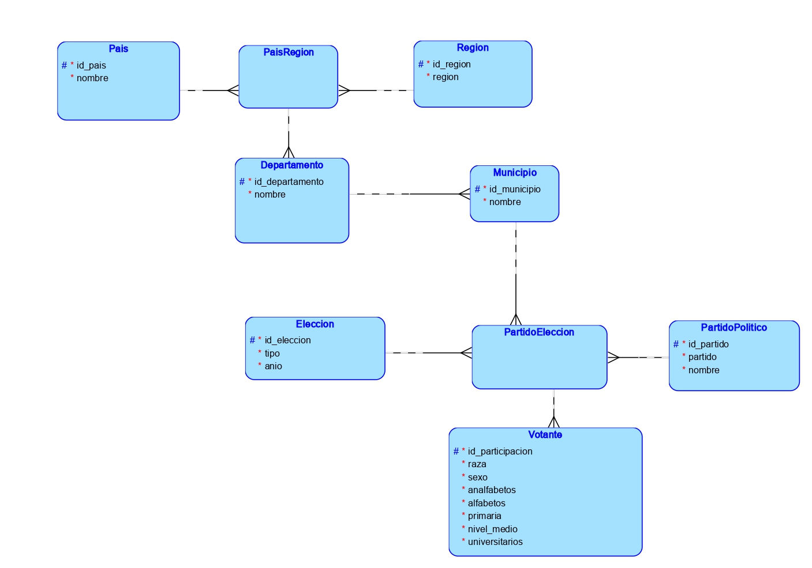

# P1_BASES1_G1
Desarrollo de un modelo relacional a partir del planteamiento de un problema y el análisis de un archivo de datos.

UNIVERSIDAD DE SAN CARLOS DE GUATEMALA  
FACULTAD DE INGENIERÍA  
ESCUELA DE CIENCIAS Y SISTEMAS    
BASES DE DATOS 1

Primer Semestre 2024

**Autores:**

**Hugo Sebastian Martínez Hernández       &nbsp;&nbsp;&nbsp; &nbsp;&nbsp;&nbsp;&nbsp;&nbsp;&nbsp;        Carné: 202002793**

**Katheryn Darleny Yuman Oscal          &nbsp;&nbsp;&nbsp; &nbsp;&nbsp;&nbsp;&nbsp;&nbsp;&nbsp;        Carné: 201902209**

**Isai Figuer Figueroa Farfan          &nbsp;&nbsp;&nbsp; &nbsp;&nbsp;&nbsp;&nbsp;&nbsp;&nbsp;        Carné: 201904013**

## Descripción de las Tablas

### Tabla: Pais
- Almacena información sobre países.
- **Columnas:**
  - `id_pais`: INT (identificador único autoincremental)
  - `nombre`: VARCHAR(100) (nombre del país, no puede ser nulo)

### Tabla: Region
- Almacena las regiones.
- **Columnas:**
  - `id_region`: INT (identificador único autoincremental)
  - `region`: VARCHAR(50) (nombre de la región, no puede ser nulo)

### Tabla: PaisRegion
- Relación entre países y regiones.
- **Columnas:**
  - `pais_id_pais`: INT (clave externa que referencia a `Pais.id_pais`)
  - `region_id_region`: INT (clave externa que referencia a `Region.id_region`)
- **Restricciones:**
  - PRIMARY KEY: (pais_id_pais, region_id_region)

### Tabla: Departamento
- Contiene información sobre departamentos.
- **Columnas:**
  - `id_departamento`: INT (identificador único autoincremental)
  - `nombre`: VARCHAR(100) (nombre del departamento, no puede ser nulo)
  - `paisregion_pais_id_pais`: INT (clave externa que referencia a `PaisRegion.pais_id_pais`)
  - `paisregion_region_id_region`: INT (clave externa que referencia a `PaisRegion.region_id_region`)

### Tabla: Municipio
- Almacena datos de municipios.
- **Columnas:**
  - `id_municipio`: INT (identificador único autoincremental)
  - `nombre`: VARCHAR(100) (nombre del municipio, no puede ser nulo)
  - `departamento_id_departamento`: INT (clave externa que referencia a `Departamento.id_departamento`)

### Tabla: PartidoPolitico
- Guarda información sobre partidos políticos.
- **Columnas:**
  - `id_partidopolitico`: INT (identificador único autoincremental)
  - `Nombre`: VARCHAR(100) (nombre corto del partido)
  - `NombreCompleto`: VARCHAR(100) (nombre completo del partido)

### Tabla: Eleccion
- Almacena detalles sobre elecciones.
- **Columnas:**
  - `id_eleccion`: INT (identificador único autoincremental)
  - `tipo`: VARCHAR(30) (tipo de elección, no puede ser nulo)
  - `anio`: INT (año de la elección, no puede ser nulo)

### Tabla: PartidoEleccion
- Relación entre partidos políticos y elecciones en municipios.
- **Columnas:**
  - `partido_id`: INT (clave externa que referencia a `PartidoPolitico.id_partidopolitico`)
  - `eleccion_id`: INT (clave externa que referencia a `Eleccion.id_eleccion`)
  - `municipio_id`: INT (clave externa que referencia a `Municipio.id_municipio`)
- **Restricciones:**
  - PRIMARY KEY: (partido_id, eleccion_id, municipio_id)

### Tabla: Votante
- Guarda información sobre votantes.
- **Columnas:**
  - `id_votante`: INT (identificador único autoincremental)
  - `sexo`: VARCHAR(10) (sexo del votante)
  - `raza`: VARCHAR(50) (raza del votante)
  - `votantes_analfabetos`: INT
  - `votantes_alfabetos`: INT
  - `votantes_primaria`: INT
  - `votantes_nivelMedio`: INT
  - `votantes_universitarios`: INT
  - `partido_id`: INT (clave externa que referencia a `PartidoPolitico.id_partidopolitico`)
  - `eleccion_id`: INT (clave externa que referencia a `Eleccion.id_eleccion`)
  - `municipio_id`: INT (clave externa que referencia a `Municipio.id_municipio`)

# Modelo lógico

# Modelo físico

